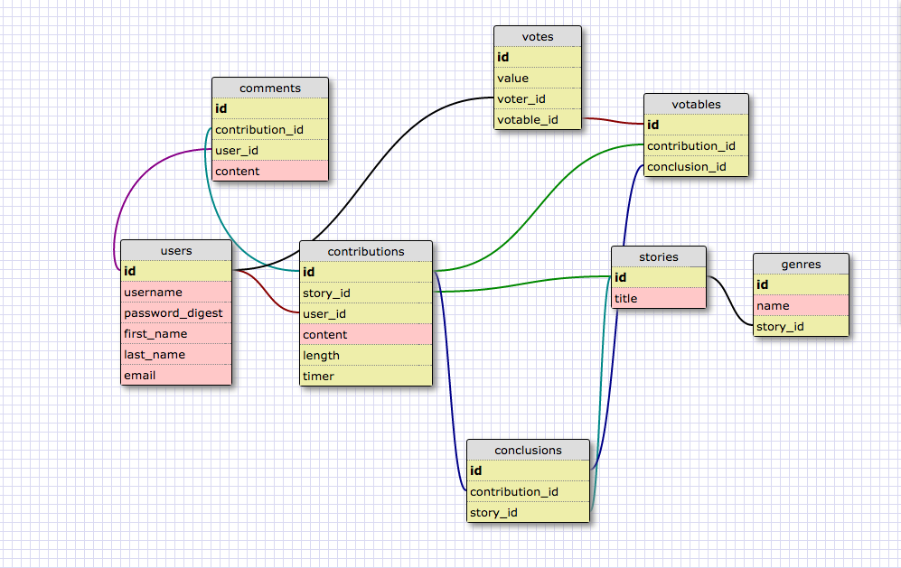

# storygame
A new take on creative writing.

##User Stories
1. As a user, I want to be able to log in.
- As a user, I want to be able to log out.
- As a user, I want to be able to register a new account.
- As a user, I want to be able to delete my account.
- As a user, I want to be able to start a story with a title and a contribution.
- As a user, I want to be able to start a story and specify the rules of contributing and have those rules enforced by the app itself.
- As a user, I want to be able to contribute a story according to a given story thread's rules.
- As a user, I want to upvote contributions if I like them.
- As a user, I want to downvote contributions if I don't like them.
- As a user, I want to be able to indicate whether or not I want to make a contribution the conclusion of a story.
- As a user, I want to be able to upvote or downvote someone's suggestion that a contribution is the conlusion of a story.
- As a user, I want to participate in conversations about the story.
- As a user, I want to be able to edit my contributions to a sotry at any time.
- As a story creator, I want to be able to tag a story with a genre.
- As a user, I want to search for a story by genre or title.
- Once a story has reached its conclusion, it no longer takes contributions.
- If there is a tie, a re-vote is held.

##Schema

